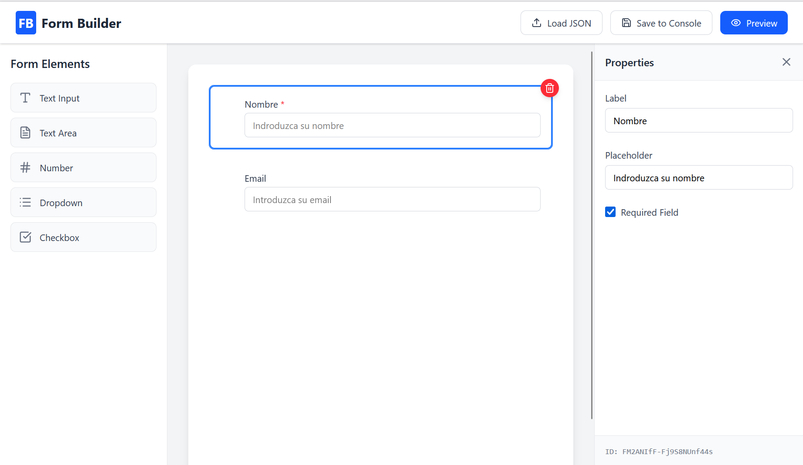

# React DnD Form Builder

A professional, "No-Code" form builder built with React 19, TypeScript, and Tailwind CSS. This project demonstrates complex state management, dynamic component rendering, and drag-and-drop interactions.



## 🚀 Features

- **Drag & Drop Interface**: Reorder form elements intuitively using `@dnd-kit`.
- **Dynamic Element Registry**: Scalable architecture to add new input types (Text, Number, Select, etc.) and layout elements.
- **Advanced Conditional Logic**: Show or hide fields based on user responses (Visibility Rules).
- **Complex State Management**: Powered by **Zustand** for high-performance updates without unnecessary re-renders.
- **Global Form Settings**: Customize form title, description, and submit button text.
- **Layout & Design Elements**: Include headers, paragraph text, and separators to structure your form.
- **Real-time Property Editor**: Modify labels, placeholders, requirement constraints, and validation rules (Min/Max, Email, etc.) on the fly.
- **Live Preview**: See exactly how the end-user will interact with your form, including functional conditional logic.
- **JSON Import/Export**: Save your entire form configuration (Metadata + Elements) to JSON or load existing ones.

## 🛠️ Tech Stack

- **Framework**: [React 19](https://react.dev/)
- **State Management**: [Zustand](https://github.com/pmndrs/zustand)
- **Drag & Drop**: [@dnd-kit](https://dndkit.com/)
- **Styling**: [Tailwind CSS v4](https://tailwindcss.com/)
- **Icons**: [Lucide React](https://lucide.dev/)
- **Utilities**: `nanoid`, `classnames`

## 📦 Architecture Highlights

### 1. The JSON Schema
The entire form configuration (including metadata and conditional rules) is serialized into a single JSON object. This allows for easy persistence and remote rendering.

### 2. Conditional Logic Engine
The `PreviewModal` implements a real-time logic engine that evaluates visibility rules whenever form values change, providing a dynamic "Typeform-like" experience.

### 3. Registry Pattern
Components are rendered through a `FieldRegistry`. Adding a new field type is as simple as creating the React component and registering it, keeping the core engine clean.

## 🏁 Getting Started

### Prerequisites
- Node.js (Latest LTS recommended)
- npm or yarn

### Installation

1. Clone the repository:
   ```bash
   git clone git@github.com:lancubal/react-dnd-form-builder.git
   cd react-dnd-form-builder
   ```

2. Install dependencies:
   ```bash
   npm install
   ```

3. Start the development server:
   ```bash
   npm run dev
   ```

## 📖 Usage

1. **Build**: Add input fields or layout elements from the left sidebar.
2. **Organize**: Drag the "grip" icon to reorder elements.
3. **Configure**: 
   - Click on a field to edit its **Properties** and **Logic Rules**.
   - Click on the canvas background to edit **Global Form Settings**.
4. **Logic**: Set visibility rules (e.g., "Show this field ONLY if 'Option A' is selected in the dropdown").
5. **Test**: Use the **Preview** button to interact with the functional form.
6. **Save**: Export the JSON configuration via "Save to Console" or import a file using "Load JSON".

---
Created by [lancubal](https://github.com/lancubal)